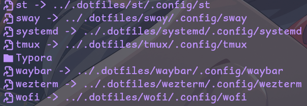

> [!NOTE]
> 我的dotfiles，使用stow管理

```bash
# 使用包管理器安装stow
sudo pacman -S stow
# 克隆仓库并命名为.dotfiles
git clone --depth 1 https://github.com/cap153/config.git ~/.dotfiles
# 进入.dotfiles文件夹
cd ~/.dotfiles
```

`stow` 可以将配置软链接到 `~/.confing` ，一些常用参数如下：

```bash
# 链接想要使用的配置
stow wezterm systemd kitty fonts
# 取消链接指定配置
stow -D wezterm kitty
# 链接全部配置
stow *
# 重新链接所有配置，相当于先-D再-S
stow -R *
```



